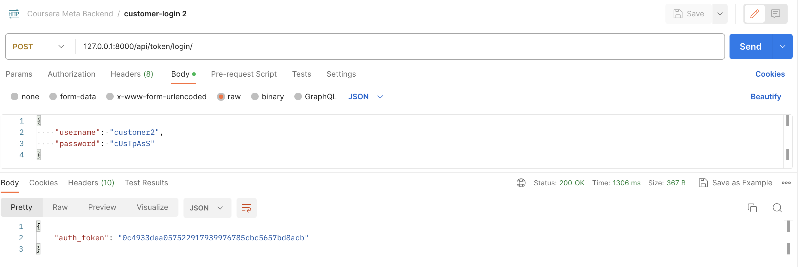

# Little Lemon API Project
This is my submission for the Cousera Little Lemon API Project for Week 4.

## Running the project
Run `pipenv shell` to get started.

## Other
More functionality can be found in this Postman shared workspace https://www.postman.com/codeforcoffeestudio/workspace/coursera-meta-backend-api-shared/collection/25176343-d9a849a0-9189-47b4-892e-c9a8da2eacb5?action=share&creator=25176343

Passwords for users can be found in notes.txt

## Required Functionality
This section covers the "Review criteria" and to show this project supports the required functionality.

### 1. The admin can assign users to the manage group
First let's take a look at `http://127.0.0.1:8000/admin/` homepage.

Below, we show that we can add a `customer1` user as a manager.

### 2. You can access the manage group with an admin token
We can manage group properties in the admin page.

### 3. The admin can add menu items
Let's look at the menu items table at `http://127.0.0.1:8000/admin/LittleLemonAPI/menuitem/`

Here we can add a new menu item

And the results

### 4. The admin can add categories
The same can be said for categories at `http://127.0.0.1:8000/admin/LittleLemonAPI/category/`. The process of adding a 

### 5. Managers can log in
I used Postman to test my project. 

. 

### 6. Managers can update the item of the day
Let's see first manager's getting all the current items.

Let's update the price of `Lemon Cake`

Then let's get that specific menu item

The same can be for item of the day, or featured.

Here, we see the price has changed from 5 to 20.
### 7. Managers can assign users to the delivery crew
First let's look at all delivery crew currently.

Let's assign a user to delivery crew and remove as well. Here we make user 5 a delivery man.

Then let's look at the users that are now delivery crew.

### 8. Managers can assign orders to the delivery crew
First let's add a couple items to a cart. We added item 3 two times, and 4 one time.

Let's review the cart.

Then create an order. The order is based on authentication token (current user)

Let's look at the order. We can also see the cart is now empty.

Here we assign delivery-crew id 4 to order 7. Then let's look at the order again.

We see that the delivery crew has been successfully assigned.

### 9. The delivery crew can access orders assigned to them
After step 8. We can see list all orders to a delivery crew.

### 10. The delivery crew can update an order as delivered
The delivery crew can update the status.

We can see status as true.

### 11. Customers can register
Let's register a customer. 

### 12. Customers can log in using their username and password and get access tokens
After registering, we can login and get an access token. 

### 13. Customers can browse all categories
As a customer we can browse all categories.

### 14. Customers can browse all the menu items at once
As a customer, we can also browse all menu items as well. Let's login as customer 1 to get the authentication key.

Then let's use the same authentication token to get all items.

### 15. Customers can browse menu items by category
Let's browse by category. Here we use Category as 2, or Seafood

### 16. Customers can paginate menu items
Pagination is shown below.

Page 1:

Page 2:

### 17. Customers can sort menu items by price
In step 18. we illustrate that we can sort by price.

However, we can also sort by multiple columns. For example, we can sort by `title` as well.

Page 1:
